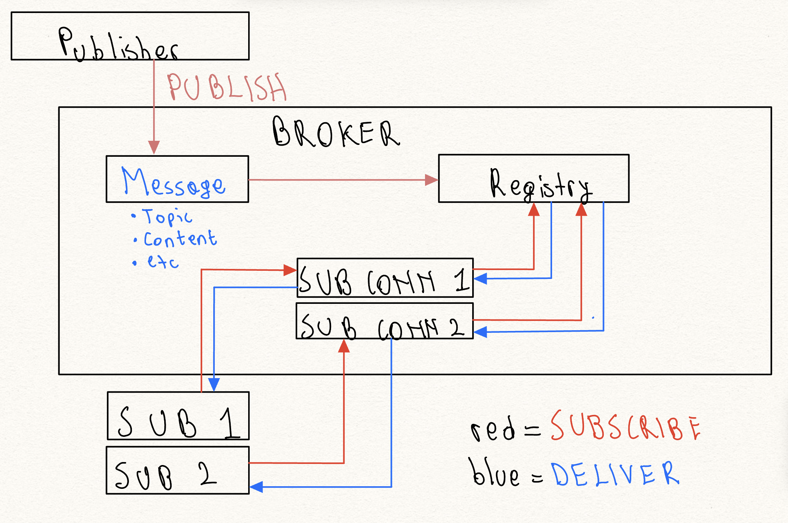

# Pub/Sub Systems :

1. Publisher 
2. Broker (helper between publisher and topics)
3. Topics 
4. Messages 
5. Subscriber 

This system supports live only delivery - that is, it doesn’t support replays. There is no polling - the broker is responsible for maintaining a registry of subscribers. The registry doesn't hold messages; messages just pass through it during publish. In concurrent scenarios, we prevent the registry from getting corrupted by using reader-writer lock. Each registry entry won’t just be a connection, it’ll have a connection handle, the outbound queue and the delivery thread, making it a real candidate for a class/object type. The outbound queue is of finite size, hence in case it’s not responsive the broker will mark the new/latest message as failed and will log it. Given we’ll use TCP connection we need a framework on how to separate messages. The approach we take is length based with a constant of 4 bytes. Each connection has a dedicated reader thread (blocks on read(), parses incoming PUBLISH/SUBSCRIBE commands). Each subscriber additionally has its own delivery thread (blocks on the outbound queue, writes to the socket) - separate from the reader because one thread can't block on read() and write() at the same time. So: subscriber connections cost 2 threads, publisher-only connections cost 1 - a known limitation mentioned in our considerations section.

1. TCP connection handle - a unique identifier to manage the connection 
2. outbound queue - this is the queue at the subscriber level. For example, if the broker sends 10 messages to subscriber A then there will be a separate thread handling the deliver of these messages, the broker at this point is done and doesn’t care how the subscriber handles its own queue of messages. In the eyes of the broker, a message is properly delivered the moment it knows the message landed in the right outbound queue. The deliver promise here is “fire and forget” and not “at-least-once” kind of delivery - and for our version 1 this is a known limitation. 

In practice this system will run as a standalone long-lived service, listening on a port. Each subscriber is a separate client program/process that opens its own TCP connection to the broker and sends SUBSCRIBE. The SubscriberConnection object that gets created - and its entry in the Registry - lives in the broker's memory for exactly as long as that specific TCP connection between that specific client and the broker stays open. 

Considerations

1. What if the broker pushes messages more frequently than a subscriber can consume? How do we handle that? 
2. We will lock the registry - but how will we do it properly? Publish and subscribe are async to each other. The registry needs a reader-writer lock, not a plain mutex, because the read (publish) and write (subscribe/unsubscribe) access patterns are asymmetric in frequency and only writes actually need exclusivity.
3.  This is thread-per-connection, which doesn't scale past a few thousand connections (C10K problem) - event-loop/epoll is the v2 fix, not needed for MVP.

At a glance:

Classes:

1. Broker
2. Registry
3. SubscriberConnection
4. Message
5. Logging 

Decisions:
delivery -> fire and forget
locking -> reader-writer 
wire protocol -> 4-byte length-prefixed framing
threading model -> reader + delivery threads 
backpressure policy -> bounded queue, drop newest and log
topic parsing -> space-delimited within the assembled frame (1st space ends the command, 2nd space ends the topic, rest is payload); safe since the frame's total length is already known from the length prefix. Constraint: topic names can't contain spaces.
 

